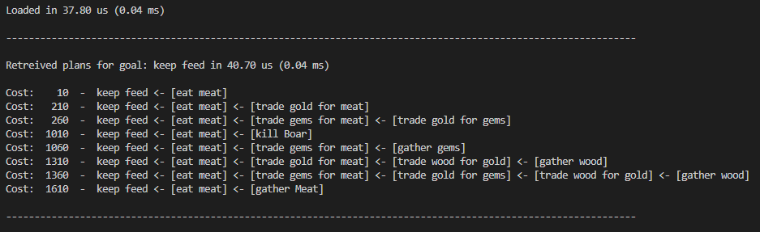
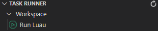

# Goal Oriented Action Planner

What problem does GOAP actually solve? GOAP's intended use it to provide real-time control of autonomous character behavior in games over traditional approaches such as FSM, BT or plain if structure. By intelligently linking goals and actions together by having a goal state, A* search algorithm is used to pre-plan all possible 'paths' to solve a particular goal. 

At runtime GOAP constantly backtest each plan to find the cheapest route that solves goal. In a similar fashion to real life at any point anything around us change so might our plans, GOAP also does this and re-evaluate it's best plan every time we tick GOAP.

 - FSM, BT's and If structures all suffer from being hard to manage once you reach a certain level of complexity where you want to avoid repeating yourself.
  
  
As a visual example of how a goal might have several paths to accomplish a single goal, this would be ***highly complicated*** to solve and as such equally prone to bugs if any changes to the code are required using the traditional approaches.


 
As seen in the example there are not too many options, but when all options are combined the options yield a great amount of variation and a source of great frustration if you were to hand craft all the given operations.
  
  
---


 This GOAP implementation is based loosely on Jeff Orkin's work on Goal Oriented Action Planning
 - Jeff Orkin's website can be found here [https://alumni.media.mit.edu/](https://alumni.media.mit.edu/~jorkin/goap.html)
 
 
---
  
  
### Short low level explanation.
 1. **Goal**: Defines a desired world state.
 2. **Plan**: Contains list of actions.
 3. **Action**: Action that fulfill a precondition to resolve a goal.

 - GOAP planner will evaluate goals based on their current priority, priority ***can*** be static or calculated at runtime.
 - If a goal that is evaluated have a higher priority than the current goal, the planner will switch to a higher priority goal, and find the best plan to execute, a goal can have multiple plans to achieve a given goal.
 - Actions behave in a similar way as goals, actions however have cost of execution, lower cost means that a action has a higher priority to run. 
 - Every time the planner ticks it will evaluate if a plan-and-or-action have a lower cost and will contribute to fulfill the goal and switch between plans and actions.

Goals and Actions both share a similar design pattern with some key differences.
 - Goals 
    - Ticked **every** time we tick the GOAP module.
    - Have priority function/attribute, higher = better.
    - Have a function to specify if the goal can be ran, which is not implemented for actions. This could maybe be useful for actions but I have not seen a use for this at the current time.

 - Actions
    - **Only** ticked when they are active.
    - Have cost function/attribute instead of priority, lower = better. 

## Mock

I have added a small tool [mock.lua](src/server/GOAP/mock.lua) that lets you virtualize goals and actions by making mock modules, useful if you want to quickly sketch different scenarios and see how they interact with eachother.



### Not Running luau code in VS Code yet?

Running luau code in VS Code can easily be achieved by downloading Luau binary [https://github.com/Roblox/luau/releases](https://github.com/Roblox/luau/releases), add to path or windows catalog.

 - Install Taskrunner extension.
 - Download the following config file [.vscode/tasks.json](.vscode/tasks.json)
 - You will then see the following option in VS Code EXPLORER  



## Limitations

 - Actions that have no preconditions are only meant to start a plan. (a action can both start and end a goal i.e. single action plan)
 - Actions that have no preconditions will **never** be evaluated in middle of a plan as this will cause cyclic recursion.
 - Plans will not try to evaluate a action that already exist in the plan, this would also cause cyclic recursion. 

## Getting Started

For testing purpose add the following script as a child of a NPC model.

```lua
local GoapPath = game:GetService("ServerScriptService"):WaitForChild("GoapModule")
local GoapModule = require(GoapPath:WaitForChild("goap"))

local goap = GoapModule.Goap.new()
goap:Load(GoapPath:WaitForChild("goals"):GetChildren(), GoapPath:WaitForChild("actions"):GetChildren())

local worldState = {}

game:GetService("RunService").Stepped:Connect(function()
	goap:Tick(worldState, script.Parent.Humanoid)
end)
```

The following examples serves as documentation thus being overly explicit.

In the following example this is a goal where we want to kill a player, the goal will scan for a target on every tick. If we have a target it check the distance between the NPC and player and clears target if the range is above 50 studs.

```lua
-- Description: A goal to kill a player
return {
    -- Why are we using a function here? We need to create new instances of this module for every planner that loads this file, otherwise bad things will happen.
    new = function()
        local common = require(script.Parent.Parent.common)
        local goap = require(script.Parent.Parent.goap)
        
        --[[
            Create a new goal, "kill player", with a desired world state of {enemyDead = true}
        
                The desired state is what we want to achieve when we run this goal, this is only used to link goals and actions together when
                the planner is building possible plans to achieve the desired state.
        
                The planner will only evaluate actions that have effects matching desired state, enabling us to build rich trees (plans) of actions and goals.
        
                Goals can have multiple desired states if you want to have "similar" goals with different outcome.
        --]]
        local module = goap.Goal.new("kill player", {enemyDead = true})
        
        -- Priority determines the order in which goals are evaluated, the planner will pick the goal having the highest priority
        -- If we have a target, we want to kill it, so return a high priority
        module.Priority = function(_, worldState: table, actor: Humanoid) : number
            return worldState.Target and 99 or 0
        end
        
        -- CanRun is called every time we tick the planner to see if we can run this goal
        -- when false this will ensure that planner not evaluate any actions further down the tree if cant run this goal
        -- this would save us from computing the cost of actions, this can quickly become an expensive operation if we have many actions and tick is ran on every frame
        module.CanRun = function(_, worldState: table, actor: Humanoid) : boolean
            return worldState.Target ~= nil
        end
        
        -- Gets called once when the goal is activated
        -- Here we could set flags, start animations or w/e you need to do to start a certain operation.
        module.OnActivated = function(worldState: table, actor: Humanoid) : boolean?
        end
        
        -- Gets called once when the goal is deactivated, either because we are done or because we are interrupted by another goal having a higher priority
        -- Here we could set flags, stop animations or w/e you need to do to cancel a certain operation.
        module.OnDeactivated = function(worldState: table, actor: Humanoid) : boolean?
        end
        
        -- OnTick gets called **every** time we tick the planner, regardless if goal is active or not
        -- OnTick expects nil, true and false returns
        -- By returning true we notify the planner that we have completed the goal and need look for new goal
        -- By returning false we notify the planner that this goal is no longer a valid goal (there is a minute difference between true and false where false will set current goal to nil and force planner to find a new goal)
        -- When nothing (nil) is returned this serves as no change and if a goal is active this does not cause any effect to the planner.
        module.OnTick = function(worldState: table, actor: Humanoid) : boolean?
            if worldState.Target == nil then
                local result, target = common.ClosestPlayerWithinView(actor, 50)
                worldState.Target = result and target or nil
            else
                if worldState.Target.Health <= 0 then
                    worldState.Target = nil
                    return true
                end
        
                if common.DiffVector(actor, worldState.Target).Magnitude > 50 then
                    worldState.Target = nil
                    return false
                end
            end
        end

        return module
    end
}
```